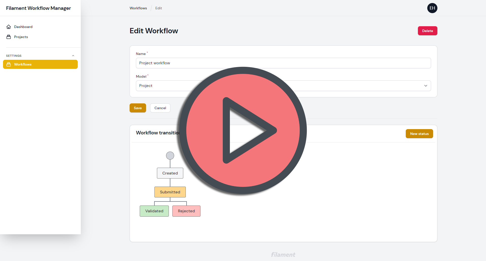

## Installation

1. Create a Laravel project
```bash
laravel new MyProject
```

2. Install the package
```bash
composer require heloufir/filament-workflow-manager
```

3. Register the package into your application providers `config/app.php`
```bash
\Heloufir\FilamentWorkflowManager\FilamentWorkflowManagerServiceProvider::class,
```

4. Run migrations
```bash
php artisan migrate
```

5. Create a new Filament user (refer to the Filament documentation)
[https://filamentphp.com/docs/2.x/admin/installation#installation](https://filamentphp.com/docs/2.x/admin/installation#installation)

6. Serve your project
```bash
php artisan serve
```
Here you can see a menu named `Workflows` under `Settings` menu group, it's where you can manage your workflows.

## Configuration

1. Create your model
```bash
php artisan make:model MyModel
```

2. Configure your model to implement Workflow manager
```php
use Heloufir\FilamentWorkflowManager\Core\HasWorkflow;
use Heloufir\FilamentWorkflowManager\Core\InteractsWithWorkflows;
// ...

class MyModel extends Model implements HasWorkflow
{
    use InteractsWithWorkflows;
    
    // ...
}
```

Here you need to add the implementation of the interface `InteractsWithWorkflows` and add the use of the trait `InteractsWithWorkflows` to your model.

3. Create a workflow


After you have configured your model, you can now create a workflow linked to this model, watch the following demo video:
[](https://user-images.githubusercontent.com/6197875/177192142-6ea200cb-9d2b-4bb3-a2b2-d65e25a4da66.mp4)

4. Add a Filament resource to manage your model
Refere to the Filament documentation: [https://filamentphp.com/docs/2.x/admin/resources/getting-started#creating-a-resource](https://filamentphp.com/docs/2.x/admin/resources/getting-started#creating-a-resource)

5. Configure the Filament resource
- In your `form` Filament resource declaration you need to add `WorkflowStatusInput::make()` so your users can change the status of `YourModel` depending on your workflow configuration:

```php
use Heloufir\FilamentWorkflowManager\Forms\Components\WorkflowStatusInput;

public static function form(Form $form): Form
{
    return $form
        ->schema([
            // ...

            WorkflowStatusInput::make()
        ]);
}
```

If you wan't to show the model current status in the Filament resource table, you need to add the `WorkflowStatusColumn::make()` column definition:

```php
use Heloufir\FilamentWorkflowManager\Tables\Columns\WorkflowStatusColumn;

public static function table(Table $table): Table
{
    return $table
        ->columns([
            // ...

            WorkflowStatusColumn::make()
        ]);
}
```

The last configuration needed, is to add `WorkflowResource` trait to the `EditRecord` and `CreateRecord` components of your model

**EditRecord component**
```php
// ...
use Heloufir\FilamentWorkflowManager\Core\WorkflowResource;

class EditMyModel extends EditRecord
{
    use WorkflowResource;

    // ...
}
```

**CreateRecord component**
```php
// ...
use Heloufir\FilamentWorkflowManager\Core\WorkflowResource;

class CreateMyModel extends CreateRecord
{
    use WorkflowResource;

    // ...
}
```

----

## History system
From the version `1.1.3` of this package, the history system is now available, and you can use it as below:

```
Important: Automatically the package will create an history row in the database, after all status update of your models
```

To show the history inside your Filament resource table you only need to add `workflow_resources_history()` function call in your table's actions:

```php
// ...
->actions([
    // ...

    workflow_resources_history()
])
// ...
```

This helper function will show a link action `History`.

When the user clicks on this link, a new tab will open and will display a table containing the history of all status changes.

## Events handler
From the version `1.1.4` of this package, on each status update the event `WorkflowStatusUpdated` is fired with a details object.

### Details object definition

| Field      | Type                                                     | Description                                                                                                                               |
|------------|----------------------------------------------------------|-------------------------------------------------------------------------------------------------------------------------------------------|
| type       | `string`                                                 | This field will contain `update` if the event is fired after the model update, or `create` if the event is fired after the model creation |
| old_status | `Heloufir\FilamentWorkflowManager\Models\WorkflowStatus` | The model old status (before update)                                                                                                      |
| new_status | `Heloufir\FilamentWorkflowManager\Models\WorkflowStatus` | The model new status (after update)                                                                                                       |
| model      | `Illuminate\Database\Eloquent\Model`                     | The model updated                                                                                                                         |
| user       | `App\Models\User` or your customized `User` model        | The user that performed the action                                                                                                        |


### Details object example

```json
{
  "type": "update",
  "old_status": {
    "id": 1,
    "name": "Created",
    "color": "#f4f6f7",
    "created_at": "2022-07-05T13:56:50.000000Z",
    "updated_at": "2022-07-05T13:56:50.000000Z",
    "deleted_at": null
  },
  "new_status": {
    "id": 2,
    "name": "Submitted",
    "color": "#bacef7",
    "created_at": "2022-07-05T13:56:50.000000Z",
    "updated_at": "2022-07-05T13:56:50.000000Z",
    "deleted_at": null
  },
  "model": {
    "id": 3,
    "name": "My model name",
    "created_at": "2022-07-05T14:23:33.000000Z",
    "updated_at": "2022-07-05T14:23:33.000000Z",
    "workflow_status_id": 1,
    "workflow_status": {
      "id": 3,
      "modelable_type": "App\\Models\\Project",
      "modelable_id": 3,
      "workflow_status_id": "2",
      "created_at": "2022-07-05T14:23:33.000000Z",
      "updated_at": "2022-07-05T14:23:36.000000Z",
      "status": {
        "id": 1,
        "name": "Created",
        "color": "#f4f6f7",
        "created_at": "2022-07-05T13:56:50.000000Z",
        "updated_at": "2022-07-05T13:56:50.000000Z",
        "deleted_at": null
      }
    }
  },
  "user": {
    "id": 1,
    "name": "EL OUFIR Hatim",
    "email": "eloufirhatim@gmail.com",
    "email_verified_at": null,
    "created_at": "2022-07-05T13:43:57.000000Z",
    "updated_at": "2022-07-05T13:43:57.000000Z"
  }
}
```

### Usage example

So to listen to this event you can define a function like below:

```php
<?php

namespace App\Filament\Resources\ProjectResource\Pages;

use Heloufir\FilamentWorkflowManager\Core\WorkflowResource;
use App\Filament\Resources\MyModelResource;
use Filament\Resources\Pages\EditRecord;

class EditMyModel extends EditRecord
{
    use WorkflowResource;

    protected $listeners = ['WorkflowStatusUpdated' => 'status_updated'];

    protected static string $resource = MyModelResource::class;

    public function status_updated($obj)
    {
        dd($obj); // $obj is the details object defined before
    }
}

```
